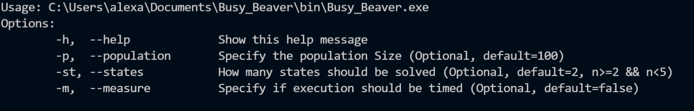
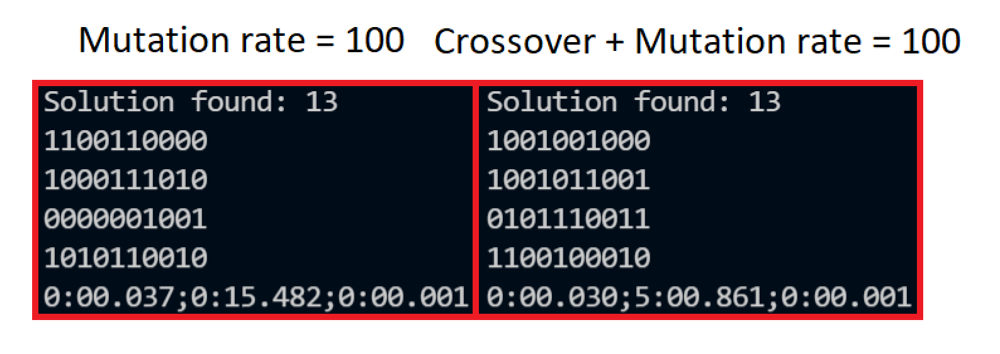

# Busy_Beaver

A Project for the University Course Symbolic AI.  
Team Members:
* Alexander Dickbauer
* Matthias Chory
* Antonia Langer

 

## Usage

 
 

## Setup
The tape is initialized with a size of 10000 and every Touring Machine uses its own tape.  
The Instruction set is created by shifting selected bits from the head array on the correct spot.
    
    //All possible instructions for a card
    int head[4] =  {0x0, 0x1, 0x2, 0x3};
    std::vector<int> generateInstructionSet(int amount_of_cards){
        std::vector<int> cards(amount_of_cards);

        for(auto i = 0; i<amount_of_cards; i++){
            cards[i] = (head[card_selector(mt)]<<8) | state_selector(mt)<<6 | (head[card_selector(mt)]<<4) | state_selector(mt);
        }

        return cards;
    }

 
 

## Parent Selection
We selected the parents for the crossover with a tournamentSelect with a size of 2

    for(auto i = 0; i< (int) population.size(); i+=2){

            ch1 = tournamentSelect(population, 2);
            ch2 = tournamentSelect(population, 2);

            crossover(ch1, ch2, next_gen[i], next_gen[i+1], 100);
    }

 
 

## Crossover
The general idea is to generate 10bit long instruction sets. 
These instruction sets can be easily crossovered by swapping segments between two parents using a one-point crossover.  

    void crossover(TouringMachine& p1, TouringMachine& p2, TouringMachine& c1, TouringMachine& c2, int chance){
        std::vector<int>child_1 = p1.getInstructionSet();
        std::vector<int>child_2 = p2.getInstructionSet();

        int child_1_value, child_2_value;
        int crosspoint = (int) pow(2, bit_selector(mt));
        int inverse_crosspoint = (1024 - crosspoint);

        for(auto i = 0; i< (int) child_1.size(); i++){
            
            child_1_value =  child_1[i] & crosspoint;
            child_2_value =  child_2[i] & crosspoint;
        

            child_1[i] = (child_1[i] &  inverse_crosspoint) | child_1_value;
            child_2[i] = (child_2[i] &  inverse_crosspoint) | child_2_value;
        }

        c1 = TouringMachine(child_1, p1.getEndcondition(), p1.getStates());
        c2 = TouringMachine(child_2, p2.getEndcondition(), p2.getStates());

        c1.mutate(chance); 
        c2.mutate(chance); 

        c1.run();
        c2.run();
    }   
 
 

## Mutation
After the crossover, there is a chance that the child mutates one random bit in every instruction set. 

 
 

## Finalization
After a solution is found it is printed.

## Found Solutions:
These are a few solutions we found using the GA.  
The solutions can be evaluated by using the test script in the folder test. 
Inside the folder test, you find an extra make file that can be used to create the test executable.

 

### N = 1
{0b1101110001}  
{0b1100100011}  
{0b1101100011}  
{0b1101010000}  

### N = 2
{0b1100110001, 0b1000011010}  
{0b1100110001, 0b1000011111}  
{0b1000111001, 0b1100010111}  
{0b1100100100, 0b1110101100}  

### N = 3
{0b1000111010, 0b1001010111, 0b1100001001}  
{0b1000110000, 0b1101011011, 0b1000011001}  
{0b1100111000, 0b1001011011, 0b1100010001}  
{0b1001010000, 0b0000011010, 0b1100101001}  

### N = 4
{0b1001100110, 0b1101000010, 0b1001101001, 0b0101010010}  
{0b1101100011, 0b0000001000, 0b0100000010, 0b1001011000}  
{0b1000101101, 0b0001101001, 0b1100110011, 0b1001010001}  
{0b1001001001, 0b0000111000, 0b1100110010, 0b0001110000}  

 

## Optimization
The computation to find a busy beaver n=4 usually took more than 5 minutes sometimes even up to 30 minutes. 
To prevent this we tweaked the GA and found out that a mutation rate of 100 improved the speed significantly. After further investigating we found this was due to a leftover code that was implemented to prevent getting stuck. It disables the Crossover and only mutates the children if the mutation rate is >=100. The logic to increase the mutation rate, if the GA isn't improving for some time was later removed but the condition remained and is now part of the final solution.

 

